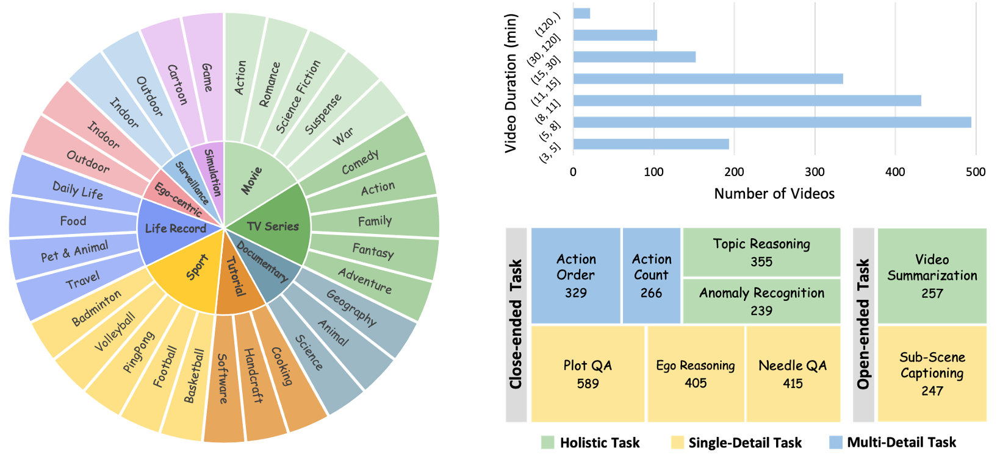
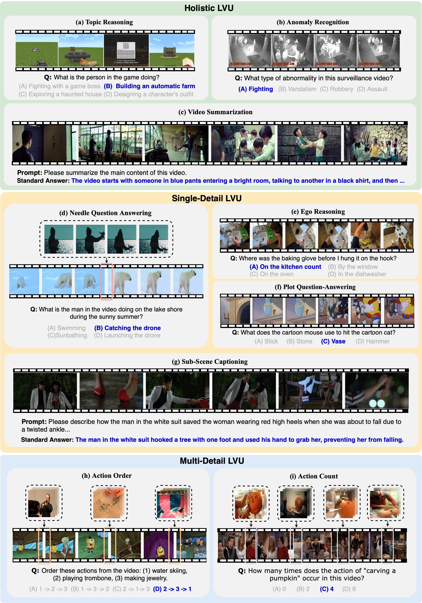

<h1 align="center">MLVU: Multi-task Long Video Understanding Benchmark</h1>
<p align="center">
    <a href="https://arxiv.org/abs/2406.04264">
            
    </a>
    <a href="https://huggingface.co/datasets/MLVU/MVLU">
        
    </a>
    <a href="https://huggingface.co/datasets/MLVU/MLVU_Test">
        
    </a>
</p>
<p align="center">
    <a href="https://mp.weixin.qq.com/s/7gjROX0T1MFApRB0WkDzMg">
        
    </a>
    <a href="https://mp.weixin.qq.com/s/Z6lU37EhpJHbJHLfUCDMRg">
        
    </a>
    <a href="https://mp.weixin.qq.com/s/-HUORRvhGVDdfPcKReXsCg">
        
    </a>
</p>

This repo contains the annotation data and evaluation code for the paper "[MLVU: A Comprehensive Benchmark for Multi-Task Long Video Understanding](https://arxiv.org/abs/2406.04264)".


## :bell: News:
- 🚀 8/23/2024: The online website for the **MLVU-Test set evaluation** has been released ([Link](http://analysis.a1.luyouxia.net:23226/)), welcome to submit your model and result!
- 🆕 7/28/2024: The data for the **MLVU-Test set** has been released ([🤗 Link](https://huggingface.co/datasets/MLVU/MLVU_Test))! The test set includes 11 different tasks, featuring our newly added Sports Question Answering (SQA, single-detail LVU) and Tutorial Question Answering (TQA, multi-detail LVU). The MLVU-Test has **expanded the number of options in multiple-choice questions to six**. While the ground truth of the MLVU-Test will remain undisclosed, everyone will be able to evaluate online (the online website will be coming soon!). 🔥
- 🎉 7/28/2024: The **MLVU-Dev set** has now been integrated into [lmms-eval](https://github.com/EvolvingLMMs-Lab/lmms-eval)! You can now conveniently evaluate the multiple-choice questions (MLVU<sub>M</sub>) of the [MLVU-Dev set](https://huggingface.co/datasets/MLVU/MVLU) with a single click using lmms-eval. Thanks to the lmms-eval team! 🔥
- :trophy: 7/25/2024: We have released the [MLVU-Test leaderboard](https://github.com/JUNJIE99/MLVU?tab=readme-ov-file#trophy-mlvu-test-leaderboard) and incorporated evaluation results for several recently launched models, such as [LongVA](https://github.com/EvolvingLMMs-Lab/LongVA), [VILA](https://github.com/NVlabs/VILA), [ShareGPT4-Video](https://github.com/ShareGPT4Omni/ShareGPT4Video), etc. 🔥
- 🏠 6/19/2024: For better maintenance and updates of MLVU, we have migrated MLVU to this new repository. We will continue to update and maintain MLVU here. If you have any questions, feel free to raise an issue. :fire:
- 🥳 6/7/2024: We have released the MLVU [Benchmark](https://huggingface.co/datasets/MLVU/MVLU) and [Paper](https://arxiv.org/abs/2406.04264)! :fire:

## License
Our dataset is under the CC-BY-NC-SA-4.0 license.

:warning: If you need to access and use our dataset, you must understand and agree: **This dataset is for research purposes only and cannot be used for any commercial or other purposes. The user assumes all effects arising from any other use and dissemination.**

We do not own the copyright of any raw video files. Currently, we provide video access to researchers under the condition of acknowledging the above license. For the video data used, we respect and acknowledge any copyrights of the video authors. Therefore, for the movies, TV series, documentaries, and cartoons used in the dataset, we have reduced the resolution, clipped the length, adjusted dimensions, etc. of the original videos to minimize the impact on the rights of the original works. 

If the original authors of the related works still believe that the videos should be removed, please contact mlvubenchmark@gmail.com or directly raise an issue.


## Introduction
We introduce MLVU: the first comprehensive benchmark designed for evaluating Multimodal Large Language Models (MLLMs) in Long Video Understanding (LVU) tasks. MLVU is constructed from a wide variety of long videos, with lengths ranging from 3 minutes to 2 hours, and includes nine distinct evaluation tasks. These tasks challenge MLLMs to handle different types of tasks, leveraging both global and local information from videos. 

Our evaluation of 20 popular MLLMs, including GPT-4o, reveals significant challenges in LVU, with even the top-performing GPT-4o only achieving an average score of 64.6% in multi-choice tasks. In addition, our empirical results underscore the need for improvements in context length, image understanding, and strong LLM-backbones. We anticipate that MLVU will serve as a catalyst for the community to further advance MLLMs' capabilities in understanding long videos.




## :trophy: Mini-Leaderboard (MLVU Dev Set)
| Model | Input | Size | M-Avg | G-Avg |
| --- | --- | --- | --- | --- |
| Full mark | - | - | 100 | 10 |
| [Oryx-1.5](https://oryx-mllm.github.io) | 128 frm | 32B | 72.3 | -- |
| [Aria](https://rhymes.ai/blog-details/aria-first-open-multimodal-native-moe-model) | 256 frm | 25B | 70.6 | 5.02 |
| [LLaVA-OneVision](https://github.com/LLaVA-VL/LLaVA-NeXT/tree/main) | 32 frm | 72B | 66.4 | -- |
| [Video-XL](https://github.com/VectorSpaceLab/Video-XL) | 256 frm | 7B | 64.9 | 4.50 |
| [GPT-4o](https://openai.com/index/hello-gpt-4o/) | 0.5&nbsp;fps | - | 64.6 | 5.80 |
| [TimeMarker](https://github.com/TimeMarker-LLM/TimeMarker/) | <=128 frm | 8B | 63.9 | 3.99 |
| [Video-CCAM](https://github.com/QQ-MM/Video-CCAM) | 96 frm | 14B | 63.1 | 4.01 |
| [VideoLLaMA2](https://github.com/DAMO-NLP-SG/VideoLLaMA2) | 16 frm | 72B | 61.2 | -- |
| [InternVL2](https://internvl.github.io/blog/2024-07-02-InternVL-2.0) | 16 frm | 76B | 59.9 | -- |
| [VILA-1.5](https://github.com/NVlabs/VILA) | 14 frm | 40B | 56.7 | 4.31 |
| [LongVA](https://github.com/EvolvingLMMs-Lab/LongVA) | 256&nbsp;frm | 7B | 56.3 | 4.33 |
| [InternVL-1.5](https://github.com/OpenGVLab/InternVL) | 16 frm | 26B | 50.4 | 4.02 |
| [GPT-4 Turbo](https://openai.com/index/gpt-4v-system-card/) | 16 frm | - | 49.2 | 5.35 |
| [VideoLLaMA2-Chat](https://github.com/DAMO-NLP-SG/VideoLLaMA2) | 16 frm | 7B | 48.5 | 3.99 |
| [VideoChat2_HD](https://github.com/OpenGVLab/Ask-Anything/tree/main/video_chat2) | 16 frm | 7B | 47.9 | 3.99 |
| [Video-LLaVA](https://github.com/PKU-YuanGroup/Video-LLaVA) | 8 frm | 7B | 47.3 | 3.84 |
| [ShareGPT4Video](https://github.com/ShareGPT4Omni/ShareGPT4Video) | 16 frm | 8B | 46.4 | 3.77 |
| [VideoChat2-Vicuna](https://github.com/OpenGVLab/Ask-Anything/tree/main/video_chat2) | 16 frm | 7B | 44.5 | 3.81 |
| [MiniGPT4-Video](https://github.com/Vision-CAIR/MiniGPT4-video) | 90 frm | 7B | 44.5 | 3.36 |
| [Qwen-VL-Max](https://github.com/QwenLM/Qwen) | 16 frm | - | 42.2 | 3.96 |
| [VTimeLLM](https://github.com/huangb23/VTimeLLM) | 100 frm | 7B | 41.9 | 3.94 |
| [LLaVA-1.6](https://github.com/haotian-liu/LLaVA) | 16 frm | 7B | 39.3 | 3.23 |
| [Claude-3-Opus](https://claude.ai/login?returnTo=%2F%3F) | 16 frm | - | 36.5 | 3.39 |
| [MA-LMM](https://github.com/boheumd/MA-LMM) | 1000 frm | 7B | 36.4 | 3.46 |
| [Video-LLaMA-2](https://github.com/DAMO-NLP-SG/Video-LLaMA) | 16 frm | 13B | 35.5 | 3.78 |
| [LLaMA-VID](https://github.com/dvlab-research/LLaMA-VID) | 1 fps | 7B | 33.2 | 4.22 |
| [Video-ChatGPT](https://github.com/mbzuai-oryx/Video-ChatGPT) | 100 frm | 7B | 31.3 | 3.90 |
| [TimeChat](https://github.com/RenShuhuai-Andy/TimeChat) | 96 frm | 7B | 30.9 | 3.42 |
| [VideoChat](https://github.com/OpenGVLab/Ask-Anything/tree/main/video_chat) | 16 frm | 7B | 29.2 | 3.66 |
| [Movie-LLM](https://github.com/Deaddawn/MovieLLM-code) | 1 fps | 7B | 26.1 | 3.94 |
| [mPLUG-Owl-V](https://github.com/X-PLUG/mPLUG-Owl) | 16 frm | 7B | 25.9 | 3.84 |
| [MovieChat](https://github.com/rese1f/MovieChat) | 2048&nbsp;frm | 7B | 25.8 | 2.78 |
| [Otter-V](https://github.com/Luodian/Otter) | 16 frm | 7B | 24.4 | 3.31 |
| [Otter-I](https://github.com/Luodian/Otter) | 16 frm | 7B | 23.3 | 3.15 |

## :trophy: MLVU-Test Leaderboard
This table is sorted by M-AVG in descending order. * means the proprietary models.
|            | Input  | Size |  TR   |  AR   |  NQA  |  ER   |  PQA  |  SQA  |  AO   |  AC   |  TQA  | M-AVG |  SSC  |  VS   | G-Avg |
|------------|--------|------|-------|-------|-------|-------|-------|-------|-------|-------|-------|-------|-------|-------|-------|
| [Aria](https://rhymes.ai/blog-details/aria-first-open-multimodal-native-moe-model)     | 256 frm | 25B | 86.8  | 64.1  | 75.0  | 56.6  | 66.0  | 58.3  | 48.6  | 25.0  | 46.5  | 58.5  | --  | --  | -- |
| [GPT-4o*](https://openai.com/index/hello-gpt-4o/)     | 0.5&nbsp;fps| -- | 83.7  | 68.8  | 42.9  | 47.8  | 57.1  | 63.6  | 46.2  | 35.0  | 48.7  | 54.9  | 6.80  | 4.94  | 5.87  |
| [TimeMarker](https://github.com/TimeMarker-LLM/TimeMarker/) | 128 frm | 8B | 85.7  | 53.9  | 65.0  | 49.1  | 52.0 | 41.7 | 31.4  | 26.7  | 37.2 | 49.2  | 4.02 | 3.20 | 3.61 |
| [LLaVA-OneVision](https://github.com/LLaVA-VL/LLaVA-NeXT/tree/main) | 32 frm | 72B | 83.5  | 56.4  | 46.7  | 58.4  | 58.0 | 27.8 |35.7  | 23.3  | 34.9 | 47.2  | 5.09 | 3.75 | 4.42 |
| [InternVL2](https://internvl.github.io/blog/2024-07-02-InternVL-2.0) | 16 frm | 76B | 85.7  | 51.3  | 48.3  | 47.2  | 52.0  |44.4  | 32.9  | 15.0  | 34.9  | 45.7  | 5.25 | 2.55 | 3.90 |
| [VideoLLaMA2](https://github.com/DAMO-NLP-SG/VideoLLaMA2) | 16 frm | 72B | 80.2  | 53.8  | 36.7  | 54.7  | 54.0  | 38.9  | 42.9  | 16.7  | 32.6  | 45.6  | 5.09 | 2.80 | 3.95 |
| [Video-XL](https://github.com/VectorSpaceLab/Video-XL) | 256 frm | 7B | 78.0  | 28.2  | 50.0  | 41.5  | 46.0  | 41.6  | 48.6  | 31.7  | 44.2  | 45.5  | 5.02 | 3.40 | 4.21 |
| [VILA-1.5](https://github.com/NVlabs/VILA)        | 14 frm | 40B | 84.7  | 56.4  | 38.3  | 35.8  | 62.0  | 38.8  | 34.3  | 11.7  | 34.9  | 44.2  | 5.11  | 2.53  | 3.82  |
| [GPT-4 Turbo*](https://openai.com/index/gpt-4v-system-card/)    | 16 frm | -- | 85.7  | 61.5  | 40.0  | 41.5  | 48.0  | 41.7  | 22.9  | 6.7   | 41.9  | 43.3  | 4.95  | 4.38  | 4.67  |
| [Video-CCAM](https://github.com/QQ-MM/Video-CCAM) | 96 frm | 14B | 79.1  | 38.5  | 45.0  | 52.8  | 56.0  | 33.3  | 24.3  | 26.7  | 30.2  | 42.9  | 4.49 | 2.65 | 3.57 |
| [LongVA](https://github.com/EvolvingLMMs-Lab/LongVA)    | 256&nbsp;frm | 7B | 81.3  | 41.0  | 46.7  | 39.6  | 46.0  | 44.4  | 17.1  | 23.3  | 30.2  | 41.1  | 4.92  | 2.90  | 3.91  |
| [InternVL-1.5](https://github.com/OpenGVLab/InternVL)   | 16 frm | 26B | 80.2  | 51.3  | 40.0  | 24.5  | 42.0  | 30.6  | 14.3  | 13.3  | 39.5  | 37.3  | 5.18  | 2.73  | 3.96  |
| [VideoChat2_HD](https://github.com/OpenGVLab/Ask-Anything/tree/main/video_chat2)| 16 frm | 7B | 74.7  | 43.6  | 35.0  | 34.0  | 30.0  | 30.6  | 21.4  | 23.3  | 23.3  | 35.1  | 5.14  | 2.83  | 3.99  |
| [VideoLLaMA2-Chat](https://github.com/DAMO-NLP-SG/VideoLLaMA2)| 16 frm | 7B| 76.9  | 35.9  | 26.7  | 34.0  | 40.0  | 27.8  | 17.1  | 15.0  | 20.9  | 32.7  | 5.27  | 2.40  | 3.84  |
| [ShareGPT4Video](https://github.com/ShareGPT4Omni/ShareGPT4Video)   | 16 frm | 8B| 73.6  | 25.6  | 31.7  | 45.3  | 38.0  | 38.9  | 17.1  | 8.3   | 25.6  | 33.8  | 4.72  | 2.53  | 3.63  |
| [VideoChat2-Vicuna](https://github.com/OpenGVLab/Ask-Anything/tree/main/video_chat2) | 16 frm | 7B | 72.5  | 30.8  | 18.3  | 28.3  | 26.0  | 36.1  | 17.1  | 23.3  | 18.6  | 30.1  | 4.80  | 2.30  | 3.55  |
| [Video-LLaVA](https://github.com/PKU-YuanGroup/Video-LLaVA) | 8 frm | 7B | 70.3  | 38.5  | 13.3  | 26.4  | 26.0  | 38.9  | 20.0  | 21.7  | 20.9  | 30.7  | 5.06  | 2.30  | 3.68  |
| [LLaVA-1.6](https://github.com/haotian-liu/LLaVA)     | 16 frm | 7B | 63.7  | 17.9  | 13.3  | 26.4  | 30.0  | 22.2  | 21.4  | 16.7  | 16.3  | 25.3  | 4.20  | 2.00  | 3.10  |
| [Claude-3-Opus*](https://claude.ai/login?returnTo=%2F%3F)   | 16 frm | -- | 53.8  | 30.8  | 14.0  | 17.0  | 20.0  | 47.2  | 10.0  | 6.7   | 25.6  | 25.0  | 3.67  | 2.83  | 3.25  |
| [VideoChat](https://github.com/OpenGVLab/Ask-Anything/tree/main/video_chat)  | 16 frm | 7B | 26.4  | 12.8  | 18.3  | 17.0  | 22.0  | 11.1  | 15.7  | 11.7  | 14.0  | 16.6  | 4.90  | 2.15  | 3.53  |
| [Video-ChatGPT](https://github.com/mbzuai-oryx/Video-ChatGPT)| 16 frm | 7B | 17.6  | 17.9  | 28.3  | 32.1  | 22.0  | 27.8  | 17.1  | 13.3  | 11.6  | 20.9  | 5.06  | 2.22  | 3.64  |
| [Video-LLaMA-2](https://github.com/DAMO-NLP-SG/Video-LLaMA)| 16 frm | 13B| 52.7  | 12.8  | 13.3  | 17.0  | 12.0  | 19.4  | 15.7  | 8.3   | 18.6  | 18.9  | 4.87  | 2.23  | 3.55  |
| [Qwen-VL-Max*](https://github.com/QwenLM/Qwen)| 10 frm | -- | 75.8  | 53.8  | 15.0  | 26.4  | 38.0  | 44.4  | 20.0  | 11.7  | 22.6  | 34.2  | 4.84  | 3.00  | 3.92  |
| [MA-LMM](https://github.com/boheumd/MA-LMM)    | 16 frm | 7B | 44.0  | 23.1  | 13.3  | 30.2  | 14.0  | 27.8  | 18.6  | 13.3  | 14.0  | 22.0  | 4.61  | 3.04  | 3.83  |
| [MiniGPT4-Video](https://github.com/Vision-CAIR/MiniGPT4-video)| 90 frm | 7B| 64.9  | 46.2  | 20.0  | 30.2  | 30.0  | 16.7  | 15.7  | 15.0  | 18.6  | 28.6  | 4.27  | 2.50  | 3.39  |
| [Movie-LLM](https://github.com/Deaddawn/MovieLLM-code)   | 1 fps | 7B| 27.5  | 25.6  | 10.0  | 11.3  | 16.0  | 16.7  | 20.0  | 21.7  | 23.3  | 19.1  | 4.93  | 2.10  | 3.52  |
| [Otter-I](https://github.com/Luodian/Otter)    | 16 frm | 7B | 17.6  | 17.9  | 16.7  | 17.0  | 18.0  | 16.7  | 15.7  | 16.7  | 14.0  | 16.7  | 3.90  | 2.03  | 2.97  |
| [Otter-V](https://github.com/Luodian/Otter)    | 16 frm | 7B | 16.5  | 12.8  | 16.7  | 22.6  | 22.0  | 8.3   | 12.9  | 13.3  | 16.3  | 15.7  | 4.20  | 2.18  | 3.19  |
| [MovieChat](https://github.com/rese1f/MovieChat)  | 2048&nbsp;frm | 7B| 18.7  | 10.3  | 23.3  | 15.1  | 16.0  | 30.6  | 17.1  | 15.0  | 16.3  | 18.0  | 3.24  | 2.30  | 2.77  |
| [mPLUG-Owl-V](https://github.com/X-PLUG/mPLUG-Owl)| 16 frm | 7B| 25.3  | 15.4  | 6.7   | 13.2  | 22.0  | 19.4  | 14.3  | 20.0  | 18.6  | 17.2  | 5.01  | 2.20  | 3.61  |
| [LLaMA-VID](https://github.com/dvlab-research/LLaMA-VID) | 1 fps | 7B| 20.9  | 23.1  | 21.7  | 11.3  | 16.0  | 16.7  | 18.6  | 15.0  | 11.6  | 17.2  | 4.15  | 2.70  | 3.43  |


## License
Our dataset is under the CC-BY-NC-SA-4.0 license.

:warning: If you need to access and use our dataset, you must understand and agree: **This dataset is for research purposes only and cannot be used for any commercial or other purposes. The user assumes all effects arising from any other use and dissemination.**

We do not own the copyright of any raw video files. Currently, we provide video access to researchers under the condition of acknowledging the above license. For the video data used, we respect and acknowledge any copyrights of the video authors. Therefore, for the movies, TV series, documentaries, and cartoons used in the dataset, we have reduced the resolution, clipped the length, adjusted dimensions, etc. of the original videos to minimize the impact on the rights of the original works. 

If the original authors of the related works still believe that the videos should be removed, please contact mlvubenchmark@gmail.com or directly raise an issue.

## MLVU Benchmark
> Before you access our dataset, we kindly ask you to thoroughly read and understand the license outlined above. If you cannot agree to these terms, we request that you refrain from downloading our video data.


The annotation file is readily accessible [here](https://github.com/FlagOpen/FlagEmbedding/tree/master/MLVU/data). For the raw videos, you can access them via this [<u>🤗 HF Link</u>](https://huggingface.co/datasets/MLVU/MVLU).


MLVU encompasses nine distinct tasks, which include multiple-choice tasks as well as free-form generation tasks. These tasks are specifically tailored for long-form video understanding, and are classified into three categories: holistic understanding, single detail understanding, and multi-detail understanding. Examples of the tasks are displayed below.





## Evaluation
Please refer to our [evaluation](https://github.com/JUNJIE99/MLVU/tree/main/evaluation) and [evaluation_test](https://github.com/JUNJIE99/MLVU/tree/main/evaluation_test) folder for more details.


## Hosting and Maintenance
The annotation files will be permanently retained. 

If some videos are requested to be removed, we will replace them with a set of video frames sparsely sampled from the video and adjusted in resolution. Since **all the questions in MLVU are only related to visual content** and do not involve audio, this will not significantly affect the validity of MLVU (most existing MLLMs also understand videos by frame extraction).

If even retaining the frame set is not allowed, we will still keep the relevant annotation files, and replace them with the meta-information of the video, or actively seek more reliable and risk-free video sources.


## Citation

If you find this repository useful, please consider giving a star :star: and citation

```
@article{MLVU,
  title={MLVU: A Comprehensive Benchmark for Multi-Task Long Video Understanding},
  author={Zhou, Junjie and Shu, Yan and Zhao, Bo and Wu, Boya and Xiao, Shitao and Yang, Xi and Xiong, Yongping and Zhang, Bo and Huang, Tiejun and Liu, Zheng},
  journal={arXiv preprint arXiv:2406.04264},
  year={2024}
}
```


